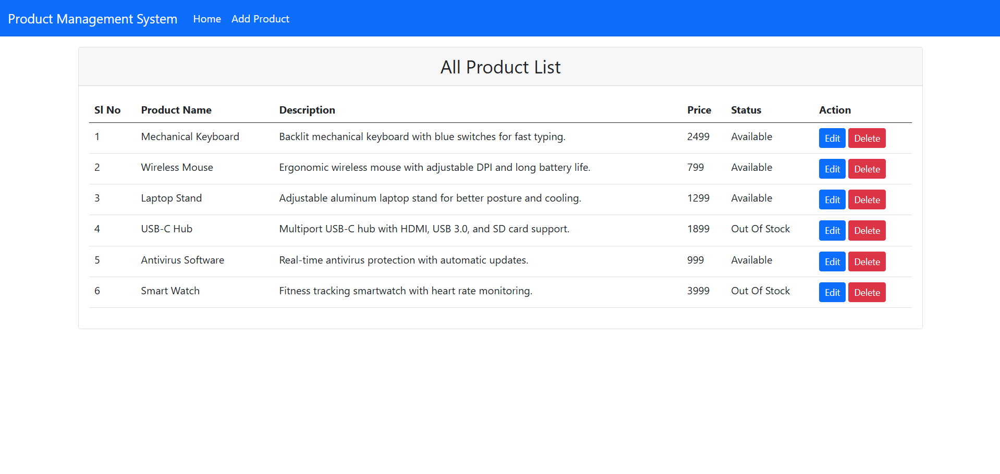
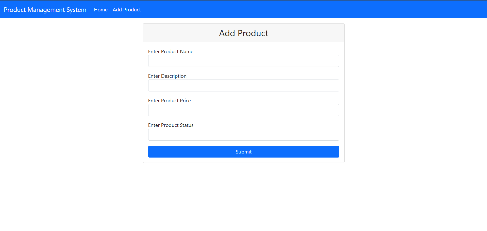
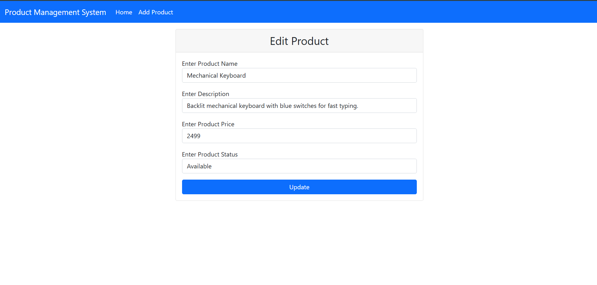

## Project Overview
A full-stack Product Management System that allows users to create, view, update, and delete products using a modern REST-based architecture.

## Screenshots

### Home Page

### Add Product

### Edit Product

# Product Management System

A full-stack Product Management System built using Java Spring Boot and React.

## Features
- Add product
- View all products
- Update product
- Delete product

## Tech Stack
- Backend: Java, Spring Boot, REST API
- Frontend: React
- Database: MySQL
- Version Control: Git & GitHub

## How to Run
### Backend
- Import backend in IDE
- Configure database
- Run Spring Boot application

### Frontend
- Navigate to frontend folder
- Run `npm install`
- Run `npm start`

## Status
Project Completed
